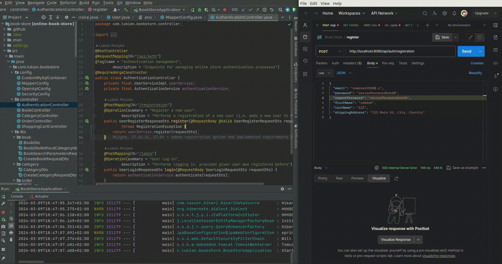
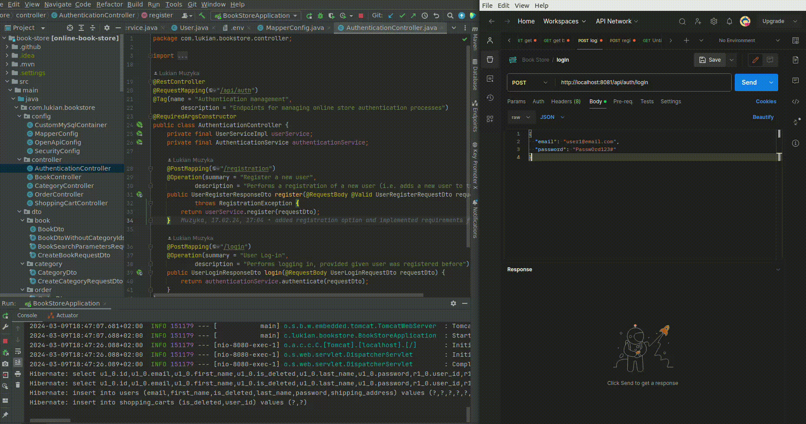

# Online Book Store management API

## Introduction
This is a Java-based RESTful application serving as the backend for an online bookstore. It offers a robust set of endpoints for managing user authentication, book and category administration, order processing, shopping cart operations and more.

> Problems solved:
> ***Authentication Security, Inventory Management, Order Efficiency, Enhanced Shopping Experience***
## Technologies Used
The project is developed using the following technologies and tools:
- **Java(17)**
- **Spring Boot**
- **Spring Security**
- **Spring Data JPA**
- **MySQL DB**
- **H2 Database** (embedded for development purposes)
- **Swagger** (for API documentation)
- **Jakarta Validation**
- **Docker**
- **Testcontainers**, **JUnit**
- **Maven** (for project management)

## Controllers functionalities Overview
### AuthenticationController
- Manages user registration and login processes.
- Endpoints:
    - `/api/auth/registration`: Register a new user.
    - `/api/auth/login`: Perform user login.

### BookController
- Handles book-related operations.
- Endpoints:
    - `/api/books`: Get all books with optional pagination.
    - `/api/books/{id}`: Get a specific book by ID.
    - `/api/books/search`: Dynamically search for books based on criteria.
    - `/api/books/{id}`: Create, update, and delete books (admin-only).

### CategoryController
- Manages book categories.
- Endpoints:
    - `/api/categories`: Create, get all, get by ID, update, and delete categories (admin-only).
    - `/api/categories/{id}/books`: Get books associated with a specific category.

### OrderController
- Handles user orders and order items.
- Endpoints:
    - `/api/orders`: Place a new order, get all orders, and update order status.
    - `/api/orders/{orderId}/items`: Get all order items for a specific order.
    - `/api/orders/{orderId}/items/{itemId}`: Get a specific order item by ID.

### ShoppingCartController
- Manages user shopping cart operations.
- Endpoints:
    - `/api/cart`: Add books to the shopping cart, get the current shopping cart, update, and delete cart items.

## Setup and Usage

## Requirements
- Java-17 or above
- MySQL server 8.0.36 or above
- Apache Maven 3.6.3 or above
- Docker 25.0.3 or above
- Git latest version
## Instalation
To set up and use the project:
1. Clone the repository:
   `git clone https://github.com/luk14n/book-store.git`
1. Build the project using Maven:
   `mvn -X clean package`.
3. Run the application: `java -jar target/*.jar`.
   or just hit play button if using Inteliji IDEA
1. Access the Swagger documentation at `http://localhost:8080/swagger-ui.html` for detailed API information.

# Authentication process example
**Register new user**

**Log-in**

# Creation process example
**Create new category (you must have admin role for this)**

`admin creds: admin@email.com:PasswOrd123@`
## Challenges
During the development process, I encountered various challenges that enhanced my learning experience. I faced difficulties in troubleshooting dependency issues, but through diligent efforts, I successfully overcame these obstacles. Also i was able to spot some gaps in the app during testing, which were successfully improved.
## Conclusion
Feel free to explore the capabilities of the Bookstore API. Hit me up if having any issues or questions. Happy coding<3